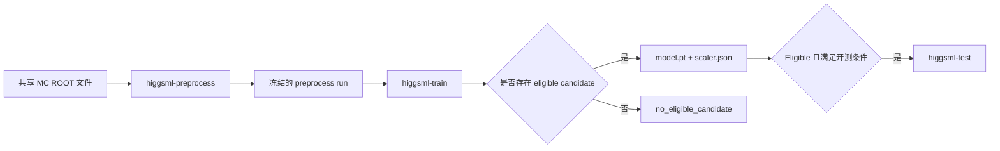

# HiggsML

HiggsML 是一个基于 Monte Carlo 数据的粒子物理机器学习演示仓库。仓库包含两个实现：

- [`neural/`](neural/)：使用 PyTorch 实现带质量去相关约束的 adversarial MLP；
- [`xgboost/`](xgboost/)：使用 XGBoost 实现分类流程；
- `data/`：两个实现共享的本地 ROOT 输入文件，不提交到 Git。

本文给出 Neural 项目从下载数据、创建环境、预处理、development 训练到 held-out test 评价的完整复现步骤。Neural 的网络原理、损失函数和代码调用流程见 [`neural/README.md`](neural/README.md)；XGBoost 的独立使用方法见 [`xgboost/README.md`](xgboost/README.md)。

本仓库仅用于 educational/technical demo。输出不构成 ATLAS 结果、Higgs discovery 或物理测量结论。

## 1. 复现范围与流程

Neural 流程按数据集处理同版 MC 配对：2020 `4lep`（345060 + 363490）或 2025 `exactly4lep`（345060 + 700600）。真实数据不会被读取、预处理、训练或评分。



完整流程分为三个项目阶段：

1. `higgsml-preprocess` 校验 ROOT 输入，执行冻结选择和特征构造，并发布带哈希的预处理产物。
2. `higgsml-train` 只使用 development split 完成五折 OOF 训练、候选比较和资格判断。
3. `higgsml-test` 在 development 合格且另有明确授权后，对 held-out MC test split 进行冻结模型评价。

数据、特征、网络、候选和训练规则都由版本化 protocol 绑定。Normal 的资格门槛保持冻结。Debug 是显式诊断模式：可使用关闭 `m4l` 质量窗的预处理协议，并通过训练命令的 `--debug` 放开输入 run 与训练协议的 SHA/封存校验；不能改变已经发布的 run，也不能用于 held-out test。

## 2. 运行约定

本文命令使用 Linux/macOS shell。开始前需要准备：

- Git；
- Conda 或兼容的 Conda 环境管理器；
- 可访问 CERN Open Data 的网络；
- 足够保存约 417 MB 原始 ROOT 文件以及后续 run 产物的磁盘空间。

命令执行目录如下：

| 操作 | 执行目录 |
|---|---|
| 克隆仓库、初始化共享数据 | 仓库根目录 |
| 创建环境、预处理、训练、test、pytest | `neural/` |

每个 preprocess、development 和 test 命令都必须使用 `neural/runs/` 下尚不存在的新目录。成功、失败或已经发布的 run 均不可覆盖或复用。下文目录名为示例，实际执行时须使用新的 run 名称。

## 3. 获取代码和共享数据

### 3.1 获取仓库

```bash
git clone git@github.com:hyi03/HiggsML.git
cd HiggsML
```

如果已经有仓库副本，直接进入仓库根目录即可。

### 3.2 下载并校验 MC 数据

下载器仅使用 Python 标准库，通过直接 HTTPS 初始化两套同 release、同 collection 的 MC 配对。无参数按 2020、2025 顺序处理四个文件：

```bash
python scripts/init_data.py
python scripts/init_data.py --dataset atlas2020_4lep
python scripts/init_data.py --dataset atlas2025_exactly4lep
python scripts/init_data.py --dataset atlas2020_4lep --force
```

| 参数 | 行为 |
|---|---|
| 无参数 | 校验并补齐两套配对；已有文件大小和 SHA-256 正确则跳过。 |
| `--dataset <name>` | 只处理指定完整配对，仅接受上述两个精确名称。 |
| `--force` | 重新下载；新文件仍须通过固定大小和 SHA-256 校验才替换目标。 |

本地文件保留官网原始文件名，以 `data/raw/<dataset>/` 隔离。同名 DSID 不代表跨 release 文件相同。四个成员如下：

| 数据集 | 样本 / DSID | 官网及本地文件名 | bytes |
|---|---|---|---:|
| `atlas2020_4lep` | higgs / 345060 | `mc_345060.ggH125_ZZ4lep.4lep.root` | 50,518,236 |
| `atlas2020_4lep` | zz / 363490 | `mc_363490.llll.4lep.root` | 179,082,866 |
| `atlas2025_exactly4lep` | higgs / 345060 | `ODEO_FEB2025_v0_exactly4lep_mc_345060.PowhegPythia8EvtGen_NNLOPS_nnlo_30_ggH125_ZZ4l.exactly4lep.root` | 182,051,943 |
| `atlas2025_exactly4lep` | zz / 700600 | `ODEO_FEB2025_v0_exactly4lep_mc_700600.Sh_2212_llll.exactly4lep.root` | 5,407,367 |

每个数据集目录还包含 `dataset_receipt.json`。单一受控定义位于 [`neural/config/datasets/`](neural/config/datasets/)，记录精确 URL、file key、官方 Adler-32、固定 SHA-256 和 tree/entry count，并由代码中的名称、修订和定义字节摘要白名单绑定。官方证据与精确摘要见[下载验证记录](neural/docs/init-data-verification.md)。运行时不会学习或更新期望哈希，不接受任意 URL、清单路径或跨版本配对。

脚本根据自身位置定位仓库，不依赖当前工作目录。已有文件损坏时返回失败，需显式 `--force` 修复。每个文件最多尝试 3 次，每次请求/读取超时 60 秒，重试等待 1、2 秒并从零开始；只清理该次调用创建的随机 `.part` 文件。校验成功后原子发布文件，两个成员最终校验均通过后才原子发布 complete receipt。中断后可保留已验证的单个文件，下次补齐；有效 receipt 在无变更重跑时保持不变。`--force` 下载失败会保留原有效文件及仍有效的 receipt，但命令仍失败。

每套配对使用 `.init-data.lock` 独占锁。锁冲突立即失败，不自动删除遗留锁。崩溃恢复时，先查看锁内 host/PID/时间，确认原进程已退出、没有其他初始化调用，再手工删除**该数据集的那个锁文件**后重试；无法确认所有权时不要删除。目录、目标、锁和 receipt 拒绝 symlink、junction/reparse point 及非普通文件目标。

退出码：`0` 表示所有请求配对完成，`1` 表示下载/校验/路径/锁失败，`2` 表示参数错误。默认模式一套失败后仍尝试另一套并保留成功配对，但总命令返回 `1`。

本次按用户要求，已有 `data/raw/higgs.root` 和 `data/raw/zz_363490.root` 经校验后已移动到对应新目录，并改为官网原名；这是一回性的本地迁移。日常下载器不读取旧平铺路径、不自动迁移或回退。`data/`、ROOT 与临时文件均被 Git 忽略。

receipt 仅证明文件字节已验证，不能代替使用方重新校验，也不代表 ROOT schema、物理归一化或训练资格。新配对接入预处理/训练/test 属于[全链重构](neural/docs/dataset-isolation-refactor-plan.md)；后文采用 v2 命令，不能将两套文件接回旧混用协议。

## 4. 当前 Neural v2 命令

以下命令从 `neural/` 执行。创建 `pytorch` 环境后安装入口；原生 ARM64 权威环境使用 `osx.yml`，Windows 开发验证使用 `win.yml`，具体见 [v2 手册](neural/docs/dataset-v2-runbook.md)。

```powershell
cd neural
conda env create --file environment.yml
conda run -n pytorch python -m pip install --no-deps -e .
conda run -n pytorch python -m pip check
conda run -n pytorch higgsml-preprocess --dataset atlas2020_4lep --protocol config/preprocess_protocol_v2.yaml --run-config config/preprocess_run.example.yaml --run-dir runs/atlas2020_4lep/preprocess-001
conda run -n pytorch higgsml-train --dataset atlas2020_4lep --input-run runs/atlas2020_4lep/preprocess-001 --protocol config/adversarial_mlp_protocol_normal_v2.yaml --run-dir runs/atlas2020_4lep/development-001
```

每次都须使用全新输出目录。2025 改用 `atlas2025_exactly4lep` 并一致修改上下游路径。预处理产出独立 development/test 分区；训练不打开 test 文件。旧 mixed 单表/协议和模型不能由新入口运行，需重新预处理。

只有同一数据集的 eligible 冻结 development run，且满足项目授权边界，才开启 test：

```powershell
conda run -n pytorch higgsml-test --dataset atlas2020_4lep --train-run runs/atlas2020_4lep/development-001 --run-dir runs/atlas2020_4lep/test-001
```

可选 `--authorization-reference <公开审计引用>` 启用持久化一次性 claim；省略时允许新的输出目录重复评价。test 不训练、重拟合 scaler 或重选阈值。`no_eligible_candidate` 是正常科学终态，禁止开启 test。三条命令支持 `--no-progress`。

Normal 特征、网络、候选及资格规则不变。训练协议的 debug 模式允许在运行前修改诊断参数，并跳过封存快照比较；这些改动只作用于新建的 debug run。成功/失败 runs 不可覆盖，不能用 test 反馈选择数据集或调参。

### 4.1 Debug：关闭预处理 m4l 质量窗

`config/preprocess_protocol_debug.yaml` 将 `selection.m4l_window_gev` 设为 `null`，因此预处理不执行默认的 `105 <= m4l < 160 GeV` 分析质量窗。debug 协议按 `protocol_id: higgsml-preprocess-debug` 识别，不依赖文件名，也不要求协议内容匹配正式 v2 的 SHA。原始 ROOT、数据集定义、DSID、entry count 和下载 receipt 的校验仍然执行。

```powershell
conda run -n pytorch higgsml-preprocess `
  --dataset atlas2020_4lep `
  --protocol config/preprocess_protocol_debug.yaml `
  --run-config config/preprocess_run.example.yaml `
  --run-dir runs/atlas2020_4lep/preprocess-debug-001
```

### 4.2 Debug development 训练

训练的 debug 状态只由 `--debug` 决定，不根据 `--protocol` 文件名或 protocol ID 自动推断。在该模式下，reader 不比较 `--input-run` 记录的文件 SHA、canonical SHA、预处理协议 SHA 和 run-config SHA；训练协议仍须是可解析 YAML 并包含运行所需字段，但不执行正式封存快照比较。数据集身份、目录安全、31 列输入结构、有限数值、来源事件身份以及 development/test 分区隔离仍然校验。

```powershell
conda run -n pytorch higgsml-train `
  --debug `
  --dataset atlas2020_4lep `
  --input-run runs/atlas2020_4lep/preprocess-debug-001 `
  --protocol config/adversarial_mlp_protocol_debug_v2.yaml `
  --run-dir runs/atlas2020_4lep/development-debug-001
```

关闭质量窗后，debug 训练接受任意有限的 `m4l`。低于 105 GeV 的背景进入第一个 adversary overflow bin，高于 160 GeV 的背景进入最后一个 overflow bin。当前 adversary 的内部 11 个箱仍对应 105–160 GeV，因此宽质量范围结果只用于诊断；全范围 AUC 不能与正式窗口内 AUC 直接比较。

如果某个 debug run 已失败或已成功发布，下一次运行必须换用新名称，例如 `preprocess-debug-002` 或 `development-debug-002`。2025 debug 运行将数据集名称和全部上下游路径一致替换为 `atlas2025_exactly4lep`。不要把 debug development run 传给 `higgsml-test`。

## 5. 验证与文档

```powershell
conda run -n pytorch python -m pytest -q
```

- [v2 操作、权重及身份边界](neural/docs/dataset-v2-runbook.md)
- [实现导航](neural/README.md)
- [全链重构方案](neural/docs/dataset-isolation-refactor-plan.md)
- [v2 实际验证记录](neural/docs/dataset-v2-verification.md)

Windows 或合成测试不能替代原生锁定 ARM64 与实际绑定数据的权威验证。项目输出仅为 educational/technical demo。
