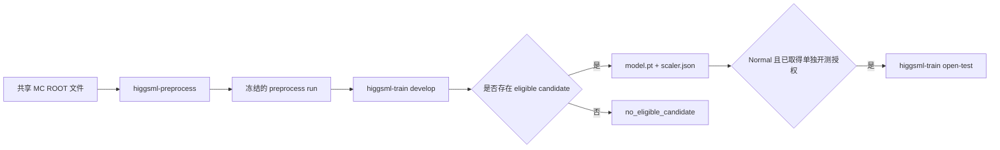

# HiggsML

HiggsML 是一个基于 Monte Carlo 数据的粒子物理机器学习演示仓库。仓库包含两个实现：

- [`neural/`](neural/)：使用 PyTorch 实现带质量去相关约束的 adversarial MLP；
- [`xgboost/`](xgboost/)：使用 XGBoost 实现分类流程；
- `data/`：两个实现共享的本地 ROOT 输入文件，不提交到 Git。

本文给出 Neural 项目从下载数据、创建环境、预处理、development 训练到 held-out test 评价的完整复现步骤。Neural 的网络原理、损失函数和代码调用流程见 [`neural/README.md`](neural/README.md)；XGBoost 的独立使用方法见 [`xgboost/README.md`](xgboost/README.md)。

本仓库仅用于 educational/technical demo。输出不构成 ATLAS 结果、Higgs discovery 或物理测量结论。

## 1. 复现范围与流程

Neural 流程只处理两个 MC 样本：Higgs 信号 DSID 345060 和 continuum ZZ 背景 DSID 363490。真实数据不会被读取、预处理、训练或评分。



完整流程分为三个项目阶段：

1. `higgsml-preprocess` 校验 ROOT 输入，执行冻结选择和特征构造，并发布带哈希的预处理产物。
2. `higgsml-train develop` 只使用 development split 完成五折 OOF 训练、候选比较和资格判断。
3. `higgsml-train open-test` 在 development 合格且另有明确授权后，对 held-out MC test split 进行一次评价。

数据、特征、网络、候选和训练规则都由版本化 protocol 绑定。Normal 的资格门槛保持冻结；Debug 只允许在开始一个新 run 前修改 AUC 和 KS 门槛，不能改变已经发布的 run，也不能用于 held-out test。

## 2. 运行约定

本文命令使用 Linux/macOS shell。开始前需要准备：

- Git；
- Conda 或兼容的 Conda 环境管理器；
- 可访问 CERN Open Data 的网络；
- 足够保存约 361 MB 原始 ROOT 文件以及后续 run 产物的磁盘空间。

命令执行目录如下：

| 操作 | 执行目录 |
|---|---|
| 克隆仓库、初始化共享数据 | 仓库根目录 |
| 创建环境、预处理、训练、test、pytest | `neural/` |

每个 preprocess、development 和 test 命令都必须使用 `neural/runs/` 下尚不存在的新目录。成功、失败或已经发布的 run 均不可覆盖或复用。本文使用 UTC 时间生成唯一目录名，并将路径保存在当前 shell 变量中；如果更换 shell，需要把变量重新设置为实际 run 路径。

## 3. 获取代码和共享数据

### 3.1 获取仓库

```bash
git clone git@github.com:hyi03/HiggsML.git
cd HiggsML
```

如果已经有仓库副本，直接进入仓库根目录即可。

### 3.2 下载并校验 MC 数据

从仓库根目录执行：

```bash
python scripts/init_data.py
```

这是本项目实现的数据初始化命令，参数如下：

| 参数 | 必填 | 含义与用法 |
|---|---|---|
| 无参数 | 否 | 创建 `data/raw/`，下载缺失文件；已有文件通过大小和 SHA-256 校验后直接跳过。 |
| `--force` | 否 | 重新下载并替换已有文件；新下载内容仍须通过大小和 SHA-256 校验。 |

需要明确重新下载时执行：

```bash
python scripts/init_data.py --force
```

脚本先写入同目录的 `.part` 临时文件，流式校验大小和 SHA-256，通过后才原子发布最终文件。成功时最后输出：

```text
Shared data initialization completed.
```

最终目录和冻结校验值如下：

| 本地文件 | 样本 | 官方来源 | 大小（bytes） | SHA-256 |
|---|---|---|---:|---|
| `data/raw/higgs.root` | Higgs，DSID 345060 | [CERN Open Data exactly4lep MC 记录](https://opendata.cern.ch/record/atlas-93928) | 182,051,943 | `5b9628ccd88547cda07bb1b2ccd88c153d9b2e53bd119416df496ba11aa925a0` |
| `data/raw/zz_363490.root` | continuum ZZ，DSID 363490 | [CERN Open Data record 15005](https://opendata.cern.ch/record/15005) | 179,082,866 | `76503d0cb2a015b814b43e5bc1887ea53a62b057e9ac2f812eaaec1efb1a3f07` |

共享数据目录应为：

```text
data/
└── raw/
    ├── higgs.root
    └── zz_363490.root
```

`data/` 已被根目录 `.gitignore` 忽略。ROOT 文件和临时下载文件不会进入 Git。

## 4. 创建 Neural 运行环境

进入 Neural 项目目录。此后的命令均从该目录执行：

```bash
cd neural
```

### 4.1 创建 Conda 环境

Linux 和 macOS 均使用普通 Conda，根据 `environment.yml` 创建名为 `pytorch` 的环境：

```bash
conda env create --file environment.yml
```

`environment.yml` 已声明环境名称、Conda channel 和项目依赖。命令执行成功后再激活该环境。

### 4.2 激活环境并安装命令入口

```bash
conda activate pytorch
```

以 editable 方式安装 Neural 包。依赖已经由前一步创建的环境提供：

```bash
python -m pip install --no-deps -e .
```

检查环境和项目命令入口：

```bash
python --version
```

```bash
python -m pip check
```

```bash
higgsml-preprocess --help
```

```bash
higgsml-train --help
```

项目固定使用 Python 3.12、PyTorch 2.7.1 和 CPU deterministic algorithms。即使 macOS 检测到 MPS，也不会把 MPS 用于权威训练。

### 4.3 运行自动化测试

```bash
python -m pytest -q
```

这里的 `pytest` 验证代码行为。它不会执行后文的 held-out test-opening，也不会授予读取 held-out test split 的权限。

## 5. 执行 MC 预处理

### 5.1 准备本地运行配置

创建 `runs/` 并复制示例配置：

```bash
mkdir -p runs
```

```bash
cp config/preprocess_run.example.yaml runs/preprocess_run.local.yaml
```

示例配置默认指向第 3 节创建的共享数据：

```yaml
schema_version: "1.0"
samples:
  higgs:
    path: ../data/raw/higgs.root
  zz:
    path: ../data/raw/zz_363490.root
resources:
  chunk_size_events: 50000
```

如果 ROOT 文件位于其他位置，只修改两个 `path` 和按本机内存调整 `chunk_size_events`。DSID、文件哈希、selection、特征、权重和 split 算法由 `config/preprocess_protocol_v1.yaml` 固定，不在本地运行配置中修改。

### 5.2 运行预处理

命令格式：

```bash
higgsml-preprocess --protocol config/preprocess_protocol_v1.yaml --run-config runs/preprocess_run.local.yaml --run-dir runs/preprocess-<unique-id>
```

`higgsml-preprocess` 参数如下：

| 参数 | 必填 | 含义与用法 |
|---|---|---|
| `--protocol <path>` | 是 | 指定版本化预处理 protocol，固定样本、选择、特征、权重、split 和输入哈希。 |
| `--run-config <path>` | 是 | 指定本地运行配置，只包含 ROOT 路径和 chunk 大小。 |
| `--run-dir <path>` | 是 | 指定 `runs/` 下全新的输出目录。目录必须尚不存在。 |
| `--no-progress` | 否 | 关闭事件进度条，适合 CI 或日志重定向。 |

实际可运行示例：

```bash
export PREPROCESS_RUN="runs/preprocess-$(date -u +%Y%m%dT%H%M%SZ)"; higgsml-preprocess --protocol config/preprocess_protocol_v1.yaml --run-config runs/preprocess_run.local.yaml --run-dir "$PREPROCESS_RUN"
```

命令成功后，检查 manifest 状态：

```bash
python -c "import json, os; print(json.load(open(os.path.join(os.environ['PREPROCESS_RUN'], 'artifacts/manifest.json'), encoding='utf-8'))['status'])"
```

预期输出为：

```text
success
```

主要产物如下：

| 文件 | 内容与用途 |
|---|---|
| `processed/mc_events.csv.gz` | 经过选择和特征构造的 MC 表，包含冻结的 development/test split 标记。 |
| `artifacts/cutflow.json` | 两个样本各阶段的事件计数、效率和加权产额。 |
| `artifacts/mc_summary.json` | 样本级和总计统计、输入绑定信息。 |
| `artifacts/manifest.json` | 最后发布，记录输入、protocol、配置、输出大小、SHA-256、schema、计数和环境。 |

只有预处理 exit code 为 `0`、manifest 状态为 `success`，并且上述文件完整时，才能把该目录传给 development。

## 6. 执行 Development 训练

Development 只访问 preprocess run 中的 development 行，不会读取 held-out test 特征。它依次训练 protocol 预注册的五个对抗强度候选 `lambda = 0, 0.05, 0.10, 0.20, 0.50`，每个候选执行五折 OOF 训练。

### 6.1 选择 Normal 或 Debug protocol

项目提供两种 training protocol：

| Protocol | 文件 | AUC/KS 门槛 | 模型输出 | Held-out test |
|---|---|---|---|---|
| Normal | `config/adversarial_mlp_protocol_normal.yaml` | 全部字段严格冻结，AUC `0.80`、KS `0.10` | `eligible` 时生成 | `eligible` 且另有授权时允许 |
| Debug | `config/adversarial_mlp_protocol_debug.yaml` | 可手工修改 `auc_minimum`、`ks_maximum` | 按调试门槛达到 `eligible` 时生成 | 始终禁止 |

Normal 用于正式、可复核的 development。Debug 用于观察不同资格门槛下的训练和模型产物；它不是权威协议，不能用于 held-out test-opening。

建议先复制一份不提交的 Debug 本地配置：

```bash
cp config/adversarial_mlp_protocol_debug.yaml runs/adversarial_mlp_protocol_debug.local.yaml
```

然后只修改其中两项：

```yaml
qualification:
  auc_minimum: 0.75
  ks_maximum: 0.20
```

两项都必须写成 `0.0–1.0` 范围内的有限小数。Debug loader 仍会拒绝其他字段的缺失、增加、改值、改类型或顺序变化。每次运行都会把完整 Debug protocol 快照及其 SHA-256 写入 development run，因此修改后的具体门槛仍然可追溯。

### 6.2 运行 Development

命令格式：

```bash
higgsml-train develop --input-run runs/preprocess-<id> --protocol config/adversarial_mlp_protocol_normal.yaml --run-dir runs/mlp-development-<unique-id>
```

`higgsml-train develop` 参数如下：

| 参数 | 必填 | 含义与用法 |
|---|---|---|
| `develop` | 是 | 选择 development-only 五折 OOF 训练和候选资格判断子命令。 |
| `--input-run <path>` | 是 | 指定第 5 节成功发布的 preprocess run。 |
| `--protocol <path>` | 是 | 指定 Normal 或 Debug adversarial MLP protocol。Normal 冻结全部规则；Debug 只允许修改 AUC/KS 资格门槛。 |
| `--run-dir <path>` | 是 | 指定 `runs/` 下全新的 development 输出目录。 |
| `--no-progress` | 否 | 关闭 fold 和 epoch 进度条。 |

在完成第 5 节的同一个 shell 中运行：

```bash
export DEVELOPMENT_RUN="runs/mlp-development-$(date -u +%Y%m%dT%H%M%SZ)"; higgsml-train develop --input-run "$PREPROCESS_RUN" --protocol config/adversarial_mlp_protocol_normal.yaml --run-dir "$DEVELOPMENT_RUN"
```

使用已经修改的 Debug protocol 运行：

```bash
export DEBUG_DEVELOPMENT_RUN="runs/mlp-development-debug-$(date -u +%Y%m%dT%H%M%SZ)"; higgsml-train develop --input-run "$PREPROCESS_RUN" --protocol runs/adversarial_mlp_protocol_debug.local.yaml --run-dir "$DEBUG_DEVELOPMENT_RUN"
```

读取 Debug 资格状态：

```bash
python -c "import json, os; print(json.load(open(os.path.join(os.environ['DEBUG_DEVELOPMENT_RUN'], 'artifacts/qualification.json'), encoding='utf-8'))['status'])"
```

训练完成后读取资格状态：

```bash
python -c "import json, os; print(json.load(open(os.path.join(os.environ['DEVELOPMENT_RUN'], 'artifacts/qualification.json'), encoding='utf-8'))['status'])"
```

Development 有两个正常终态：

| 状态 | 含义 | 是否生成模型 | 是否可申请 open-test |
|---|---|---|---|
| `eligible` | 至少一个候选满足所选 protocol 的全部资格条件，已选择候选并完成全 development final fit。 | 是 | 仅 Normal 可申请，且仍需单独授权 |
| `no_eligible_candidate` | 所有候选至少违反一项资格条件。运行正常结束并保留诊断证据。 | 否 | 否 |

`no_eligible_candidate` 的进程退出码也是 `0`，因为它是声明的科学终态，不是程序异常。

### 6.3 Development 产物

| 文件 | 生成条件 | 内容与用途 |
|---|---|---|
| `config.yaml` | 始终生成 | 绑定 input run、preprocess manifest、training protocol 哈希及 protocol 快照。 |
| `artifacts/candidate_metrics.csv` | 始终生成 | 每个 lambda 的 weighted OOF AUC、三个工作点阈值、效率、KS 和拒绝原因。 |
| `artifacts/fold_metrics.csv` | 始终生成 | 每个 lambda、fold、epoch 的损失、validation AUC 和 early-stopping 信息。 |
| `artifacts/qualification.json` | 始终生成 | 最终状态、全部候选、选定 lambda 和 final-fit epoch。 |
| `artifacts/working_points.json` | 始终生成 | 各候选的 loose、medium、tight 工作点和冻结阈值。 |
| `predictions/oof_scores.csv.gz` | 始终生成 | 每个候选的完整五折 out-of-fold 分数。 |
| `plots/auc_vs_lambda.png` | 始终生成 | 各候选 AUC 对比。 |
| `plots/ks_vs_lambda.png` | 始终生成 | 各候选三个工作点的 KS 对比。 |
| `plots/oof_roc.png` | 始终生成 | 选定候选或最高 AUC 候选的 OOF ROC。 |
| `plots/oof_mass_sculpting.png` | 始终生成 | 分数选择前后的背景质量分布诊断。 |
| `model/model.pt` | 仅 `eligible` | 最终 PyTorch 模型权重和评分绑定信息。 |
| `model/scaler.json` | 仅 `eligible` | 全 development 拟合的 15 项特征标准化参数。 |
| `artifacts/manifest.json` | 始终生成且最后写入 | 绑定输入、protocol、全部输出哈希、schema、计数、环境和科学边界。 |

### 6.4 `model.pt` 包含什么

只有状态为 `eligible` 时，程序才会在全 development 数据上重新训练最终模型并生成 `model/model.pt`。该文件包含：

- schema 版本和 training protocol SHA-256；
- 固定的 15 项特征及顺序；
- final-fit scaler 快照；
- 选定 lambda、随机种子和训练 epoch 数；
- classifier 与 adversary 的 `state_dict`；
- 训练环境记录。

`model.pt` 不能脱离 `model/scaler.json`、冻结 protocol、特征顺序和 manifest 独立使用。正式 test 评分只使用 classifier 权重，但会先验证整个模型、scaler 和 lineage 的完整绑定。

如果找不到 `model.pt`，首先读取 `artifacts/qualification.json`。状态为 `no_eligible_candidate` 时，不生成 `model/` 目录是预期行为；不得手工创建模型占位文件、修改 manifest 或强制把该 run 标记为 `eligible`。

## 7. 理解 AUC、KS、效率和阈值

AUC、KS 和效率是通用统计或机器学习指标；本项目采用的合格数值是预先注册在 protocol 中的项目规则，不是统一行业标准。

| 指标或规则 | 本项目中的含义 | Normal 资格要求 |
|---|---|---|
| Weighted OOF AUC | 使用 `train_weight` 衡量信号与背景的整体排序能力；`0.5` 接近随机，`1.0` 表示完全区分。 | `AUC >= 0.80` |
| Weighted KS | 使用 `abs(physical_weight)` 比较全部 OOF 背景与通过阈值的 OOF 背景之间 `m4l` 累积分布的最大差异。 | 三个工作点均 `KS <= 0.10` |
| 背景效率 | 通过分数选择的背景绝对权重占全部背景绝对权重的比例。 | loose、medium、tight 目标分别为 `0.50`、`0.20`、`0.10` |
| 信号效率 | 通过相同分数选择的信号绝对权重占全部信号绝对权重的比例。 | 每个工作点严格大于实际背景效率 |

每个 lambda 候选都在自己的 OOF 背景上确定三个 score threshold：按 score 从高到低稳定排序，累加 `abs(physical_weight)`，第一次达到目标背景效率时的 score 就是阈值。事件选择使用 `score >= threshold`，因此相同 score 的事件会全部保留，实际背景效率可能略高于目标值。

候选必须同时满足以下条件才是 `eligible`：

```text
weighted OOF AUC >= 0.80
loose、medium、tight KS 均 <= 0.10
每个工作点 signal_efficiency > achieved_background_efficiency
```

资格比较不使用浮点容差。只有多个合格候选的 AUC 与最佳值差异不超过 `1e-6` 时，选择阶段才使用 tie rule 并优先较小 lambda。

Normal 的 AUC、KS、效率目标和 threshold 选择规则全部冻结，不能通过命令行覆盖。Debug 允许在运行前手工修改 `auc_minimum` 和 `ks_maximum`，但每次必须使用新的 run 路径；运行开始后不得回改已发布 run 的 protocol 快照或产物。

## 8. 执行 Held-out Test（非 pytest）

`higgsml-train open-test` 是对 held-out MC test split 的一次性模型评价，与第 4.3 节的代码测试不同。执行前必须同时满足：

1. Development run 使用 Normal protocol，且 `artifacts/qualification.json` 和 manifest 状态均为 `eligible`。
2. `model/model.pt`、`model/scaler.json`、working points 和全部哈希绑定完整。
3. 针对该 development run 已取得单独、明确的外部开测授权。
4. Development run 中尚不存在 `state/test_opening.json`。

命令格式：

```bash
higgsml-train open-test --development-run runs/mlp-development-<id> --run-dir runs/mlp-test-<unique-id> --authorization-reference <external-approval-reference>
```

`higgsml-train open-test` 参数如下：

| 参数 | 必填 | 含义与用法 |
|---|---|---|
| `open-test` | 是 | 选择一次性 held-out MC test 评价子命令；不会重新训练或重新选择阈值。 |
| `--development-run <path>` | 是 | 指定完整、冻结且状态为 `eligible` 的 development run。 |
| `--run-dir <path>` | 是 | 指定 `runs/` 下全新的 test 输出目录。 |
| `--authorization-reference <value>` | 是 | 指定外部批准记录的公开、非敏感审计标识。 |

### 8.1 配置 authorization reference

`--authorization-reference` 是命令行参数，不写入 preprocess 或 training YAML。将占位符替换为审批系统中对应的工单号、批准记录编号或其他稳定短标识，例如：

```text
MLP-TEST-APPROVAL-2026-09-03-001
```

该值会记录在 test 配置、test manifest 和 development run 的 `state/test_opening.json` 中。它必须满足：

- 去除首尾空白后非空；
- 不超过 256 个 Unicode 字符；
- 不包含控制字符或格式控制字符；
- 不包含 `password=`、`api_key=`、`secret=`、`token=`、`credential=` 等凭据赋值形式。

不要填写审批正文、密码、API key、访问令牌或其他敏感信息。程序只保存这个外部引用，不会联网查询审批系统，也不会把任意字符串自动视为真实授权。

### 8.2 运行一次性 test

确认授权和 development run 后，在同一个 shell 中执行：

```bash
export AUTHORIZATION_REFERENCE="MLP-TEST-APPROVAL-2026-09-03-001"; export TEST_RUN="runs/mlp-test-$(date -u +%Y%m%dT%H%M%SZ)"; higgsml-train open-test --development-run "$DEVELOPMENT_RUN" --run-dir "$TEST_RUN" --authorization-reference "$AUTHORIZATION_REFERENCE"
```

命令在读取 test 特征前，会在源 development run 中原子创建永久的 `state/test_opening.json`。同一个 development run 只能开启一次；claim 创建后，即使运行失败或中断，也不得直接重试。

Test run 的主要产物如下：

| 文件 | 内容与用途 |
|---|---|
| `predictions/test_scores.csv.gz` | 每个 held-out test 事件的身份、标签、`m4l`、权重和冻结模型分数。 |
| `artifacts/test_metrics.json` | Test weighted AUC、三个冻结工作点的效率、KS、通过项和拒绝原因。 |
| `plots/test_roc.png` | Held-out test ROC。 |
| `plots/test_mass_sculpting.png` | 冻结工作点下的背景质量分布诊断。 |
| `artifacts/manifest.json` | 绑定授权引用、development/preprocess lineage、protocol、模型、scaler、阈值和全部 test 输出。 |

读取 test 终态：

```bash
python -c "import json, os; print(json.load(open(os.path.join(os.environ['TEST_RUN'], 'artifacts/test_metrics.json'), encoding='utf-8'))['status'])"
```

正常 test 终态包括：

| 状态 | 含义 |
|---|---|
| `test_reproduced` | Held-out test 指标满足 development 中冻结的资格规则。 |
| `test_nonreproduction` | 评价完成，但至少一项 held-out test 指标未复现冻结要求。 |

`test_nonreproduction` 是正常科学结果。程序不会据此重新训练、重新选 threshold、增加候选或修改门槛。

## 9. 复现完成检查清单

按顺序确认以下内容：

- `data/raw/higgs.root` 和 `data/raw/zz_363490.root` 的大小、SHA-256 与第 3 节一致；
- `python -m pip check` 成功，两个项目 CLI 的 `--help` 可运行；
- preprocess manifest 状态为 `success`，并且 manifest 是该 run 最后发布的完整输出索引；
- development 的 `qualification.json` 状态为 `eligible` 或 `no_eligible_candidate`；
- 只有 `eligible` run 才存在 `model/model.pt` 和 `model/scaler.json`；
- held-out test 仅在 eligible、完整、未开启且已取得单独授权时运行一次；
- 每个阶段使用不同且先前不存在的 `runs/` 子目录；
- 保存实际命令、run 路径、manifest、protocol 哈希和最终状态，便于复核。

## 10. 退出码与常见问题

Neural CLI 使用以下稳定退出码：

| 退出码 | 含义 |
|---:|---|
| `0` | 成功，或者 `no_eligible_candidate`、`test_nonreproduction` 等声明的正常科学终态 |
| `2` | 命令行参数错误 |
| `3` | 输入、schema、哈希或 protocol 绑定失败 |
| `4` | run 路径或事务失败 |
| `5` | 资格或 test-opening 被拒绝 |
| `70` | 未预期的内部错误 |

### 找不到 `higgsml-preprocess` 或 `higgsml-train`

确认已经进入 `neural/`、激活 `pytorch` 环境，并执行过：

```bash
python -m pip install --no-deps -e .
```

### `--run-dir` 已存在

不要删除或覆盖已有 run。重新生成一个目录名并再次运行相应阶段：

```bash
export PREPROCESS_RUN="runs/preprocess-$(date -u +%Y%m%dT%H%M%SZ)"
```

### Development 成功但没有 `model.pt`

检查 `artifacts/qualification.json`。如果状态为 `no_eligible_candidate`，说明没有候选同时通过 AUC、三个 KS 和三个效率条件；不生成模型是协议要求。各候选的具体失败原因位于 `artifacts/candidate_metrics.csv` 和 `qualification.json`。

### `open-test` 返回退出码 5

常见原因包括 development 不合格、model/scaler 或哈希绑定不完整、authorization reference 无效，或者该 development 已经存在 test-opening claim。不要通过修改 artifact、删除 claim 或更换门槛绕过拒绝。

### 需要调整 AUC 或 KS 门槛

当前 `develop` 不接受 AUC/KS 命令行覆盖参数。正式运行使用 Normal protocol；调试时复制 `config/adversarial_mlp_protocol_debug.yaml`，只修改 `auc_minimum` 和 `ks_maximum`，并使用新的 development run。Debug 生成的模型不能执行 open-test。

## 11. 验证边界与参考文档

当前仓库交付状态不等于已经完成权威 full-data 复现。locked native `osx-arm64` full-data preprocess golden、完整 development OOF 和按条件授权的 open-test，只有在实际运行并保留证据后才能分别声明完成。Linux 或其他环境的测试与运行结果可以作为开发证据，但不能替代锁定的 macOS Apple Silicon 权威 gate。

进一步信息见：

- [Neural 实现原理与代码流程](neural/README.md)
- [对抗式 MLP 重构设计](neural_adversarial_mlp_refactor_design.md)
- [Preprocess Protocol V1](neural/docs/preprocess-protocol-v1.md)
- [Development Protocol V1](neural/docs/development-protocol-v1.md)
- [Adversarial MLP Normal Protocol](neural/docs/adversarial-mlp-protocol-normal.md)
- [Test-opening Protocol V1](neural/docs/test-opening-protocol-v1.md)
- [运行手册](neural/docs/runbook.md)
- [Artifact Schema](neural/docs/artifact-schema.md)
- [M1-06 验证证据](neural/docs/m1-06-verification-evidence.md)
- [最终技术报告](neural/docs/final-technical-report.md)
- [Neural 项目约束](neural/AGENTS.md)
