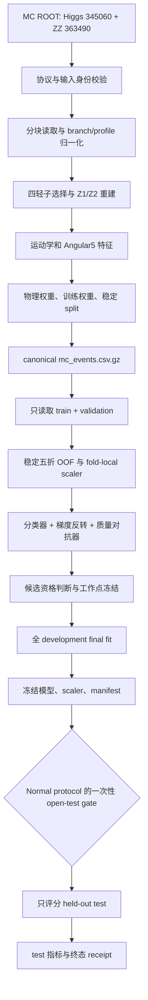

# HiggsML Neural 实现原理与代码处理流程

`neural/` 实现了一个严格 MC-only 的 PyTorch adversarial MLP。分类器学习区分 Higgs 345060 与 continuum ZZ 363490；背景质量对抗器尝试从分类器 logit 还原 `m4l` 区间，梯度反转层则迫使分类器降低对背景质量的依赖。项目的目标是形成可复核的 educational/technical demo，并不构成 ATLAS 结果、Higgs discovery 或 physics measurement。

安装、环境验证和运行命令统一维护在[仓库根 README](../README.md)。科学边界和实施决策见[对抗式 MLP 重构设计](../neural_adversarial_mlp_refactor_design.md)。

## 1. 系统边界

实现将科学规则、运行参数和产物发布分开处理：

- `config/preprocess_protocol_v1.yaml` 固定输入身份、选择条件、特征、权重、数据切分和 canonical 输出规则。
- `config/adversarial_mlp_protocol_normal.yaml` 固定网络结构、候选 lambda、训练日程、资格门槛、工作点和产物 schema。
- `config/adversarial_mlp_protocol_debug.yaml` 保持相同训练结构，只允许在运行前修改 `auc_minimum` 和 `ks_maximum`；其 run 可以生成调试模型，但不能进入 held-out test-opening。
- 本地 preprocess run config 只提供 ROOT 路径与 chunk 大小，不能覆盖科学规则。
- `src/domain/` 只负责物理对象重建、事件选择、特征、权重和稳定切分。
- `src/preprocessing/` 与 `src/training/` 编排处理流程；`src/cli/` 只解析参数、映射退出码。
- `src/artifacts/` 负责 canonical 序列化、manifest、绘图和不可覆盖的事务发布。

运行代码不依赖 `xgboost/src`。两种实现只共享经身份与哈希绑定的输入和用于 authority comparison 的历史基线。

## 2. 端到端数据流



每个阶段都先验证上游 manifest、schema、哈希和行数，再读取或计算数据。正常产物先写入同级临时目录，最后通过 rename 原子发布；目标 run 已存在、位于 `runs/` 之外或路径含链接/reparse point 时会失败关闭。

### 2.1 固定数据划分

数据固定分为：

- `train`：训练模型
- `validation`：early stopping、选择 λ、冻结阈值
- `test`：开发期间不得读取特征，只在最终模型合格后开启一次

`train` 和 `validation` 共同构成 development 范围。候选 λ 在该范围内执行固定五折 OOF；每折只用 fitting rows 拟合 scaler 和模型，并用对应 validation rows 做 early stopping。λ 选择和工作点阈值冻结只使用完整 OOF 结果。development 阶段只能知道 `test` 的行数，不能解码或读取其特征值。

### 2.2 训练与 held-out test 流程

这里的 test 指模型的 held-out test 评价，不是 `pytest` 软件测试。首先对一个已经成功发布的 preprocess run 执行 development 训练，并为输出使用全新的 run 路径：

```bash
higgsml-train develop --input-run runs/preprocess-<id> --protocol config/adversarial_mlp_protocol_normal.yaml --run-dir runs/mlp-development-<id>
```

调试运行可以改用 `config/adversarial_mlp_protocol_debug.yaml` 或其本地副本。Loader 只放开 `qualification.auc_minimum` 和 `qualification.ks_maximum`，仍严格校验其他字段，并把完整 protocol bytes 和 SHA-256 绑定到 run。

development 依次训练 protocol 中预注册的全部 λ 候选，为每个候选生成完整五折 OOF 分数，然后按冻结的 AUC、KS 和效率门槛判断资格：

1. 每折使用 fold-local scaler，early stopping 只观察该折的 weighted validation AUC。
2. 完整 OOF 用于计算 weighted AUC，并在 loose、medium、tight 三个背景效率工作点冻结阈值。
3. 只有同时满足全部资格门槛的候选才进入选择；若多个候选合格，按 protocol 的 AUC 和 λ tie rule 选择。
4. 选定 λ 后，使用五折最佳 epoch 的中位数，在完整 development 数据上拟合 final scaler 和 final model。

训练指标和判定证据位于 development run：

- `artifacts/candidate_metrics.csv`：每个 λ 的 OOF AUC、三个工作点的阈值、效率、KS 和拒绝原因。
- `artifacts/fold_metrics.csv`：每折每个 epoch 的损失、validation AUC、最佳 epoch 和 early-stopping 状态。
- `artifacts/qualification.json`：最终状态、候选资格、选定 λ 和 final epoch 数。
- `artifacts/working_points.json`：所有候选的工作点；合格时包含最终冻结结果。
- `predictions/oof_scores.csv.gz`：development OOF 分数。
- `plots/auc_vs_lambda.png`、`plots/ks_vs_lambda.png`、`plots/oof_roc.png` 和 `plots/oof_mass_sculpting.png`：development 图形证据。

若状态为 `no_eligible_candidate`，该 run 是正常发布的科学终态，但不会生成 final model/scaler，也不得执行 test-opening。应保留该 run 的完整证据。正式 Normal 规则不得放宽；诊断时可以复制 Debug protocol，只修改 AUC/KS 门槛并创建新的 run。已经发布的 run 不能修改，Debug run 也不能进入 test-opening。

只有使用 Normal protocol 的 development 状态为 `eligible`，并已取得单独的 held-out test 开启授权后，才能执行一次性 test-opening。Debug run 即使按调试门槛达到 `eligible` 并生成模型，也会在 claim 和 test feature decode 前被拒绝：

```bash
higgsml-train open-test --development-run runs/mlp-development-<id> --run-dir runs/mlp-test-<id> --authorization-reference "<approval-reference>"
```

test-opening 会先验证 development lineage、资格状态、冻结模型、scaler、阈值和产物哈希，再持久化一次性 claim；claim 成功后才读取 held-out test 特征。test 阶段只使用冻结模型和阈值进行评分，不重新训练、不重新拟合 scaler、不重新选择 λ 或阈值。

test 指标和证据位于新的 test run：

- `artifacts/test_metrics.json`：held-out test AUC、冻结工作点上的信号/背景效率、KS 和最终复现状态。
- `predictions/test_scores.csv.gz`：test 分数。
- `plots/test_roc.png` 和 `plots/test_mass_sculpting.png`：test 图形证据。
- `artifacts/manifest.json`：输入 lineage、授权引用、边界声明、输出哈希和终态。

test-opening 是一次性状态转换。claim 之后无论成功或失败，都必须按终态证据处理，不能用同一个 development run 重试或继续调参。
## 3. 预处理实现分析

入口 `src.cli.preprocess:main` 调用 `src.preprocessing.pipeline.execute_preprocess`，处理过程如下：

1. `src/config.py` 加载并严格校验 protocol 与 run config，拒绝未知字段和越权配置。
2. `src/preprocessing/root_reader.py` 按 protocol 中每个样本的 tree、branch 映射、单位和预期 entry count 分块读取 ROOT。
3. pipeline 在处理事件前比对输入 SHA-256，并检查实际 `channelNumber` 只包含该样本绑定的 DSID。
4. `src/domain/selection.py` 依次执行轻子数、触发、动量、赝快度、隔离、impact parameter、SFOS、Z1/Z2 和 `m4l` 窗口选择，同时累计逐级 cutflow。
5. `src/domain/reconstruction.py` 构造四动量并确定 Z1/Z2；`features.py` 生成普通运动学特征；`angular5.py` 在相应参考系中生成五个角变量。
6. `weights.py` 计算带符号的 `physical_weight`，并按 protocol 生成供优化器使用的非负 `train_weight`。两者用途分离，避免将物理产额权重直接误用为损失权重。
7. `splitting.py` 对 `channelNumber:eventNumber` 做 BLAKE2b 稳定哈希，将数据按 6:2:2 固定分配到 train、validation、test；重复运行和不同 chunk 大小不会改变 split。
8. pipeline 验证 `source_sample + source_entry` 的 canonical 身份唯一性，按冻结列序输出 deterministic gzip CSV、cutflow、样本汇总与 manifest。

预处理表包含重建变量、标签、split、两类权重和 provenance 字段。它是可审计的中间数据契约，不等同于模型输入。

## 4. 模型输入与对抗去相关

分类器只接收以下 15 项固定特征：

| 类型 | 特征 |
|---|---|
| 轻子运动学 | `lep1_pt`, `lep2_pt`, `lep1_eta`, `lep2_eta`, `lep3_eta`, `lep4_eta` |
| 四轻子与 Z 系统 | `pt4l`, `deltaR_Z1`, `deltaR_Z2`, `deltaPhi_ZZ` |
| Angular5 | `cos_theta_star`, `cos_theta_1`, `cos_theta_2`, `phi_decay_planes`, `phi_production_plane` |

`m4l`、`mZ1`、`mZ2`、`lep3_pt`、`lep4_pt`、label、split、权重和所有身份/provenance 字段都被 protocol 明确列为 forbidden features。它们可以服务于选择、训练控制、评价或审计，但不能进入分类器张量。

`src/training/network.py` 定义两个网络：

- 分类器为 `15 → 64 → 64 → 32 → 1`，使用 LayerNorm、SiLU 和固定 dropout，总参数量 7,617。
- 对抗器以单个分类 logit 为输入，通过 `1 → 32 → 32 → 11` 预测 105–160 GeV 间的 11 个 `m4l` bin，总参数量 1,611。

梯度反转层前向保持 logit 不变，反向把来自对抗器的梯度乘以 `-lambda_effective`。因此对抗器本身学习提高质量 bin 判别能力，而分类器沿相反方向更新，减少其 logit 中可用于恢复背景质量的信息。

分类损失是按 `train_weight` 加权的 binary cross entropy。对抗损失只作用于背景事件，先对 `physical_weight` 取绝对值，再在每个质量 bin 内归一化，以免高统计 bin 主导去相关目标。lambda 前 5 个 epoch 为 0，之后用 10 个 epoch 线性升至候选目标值。

模型、特征张量和 state dict 被强制为 CPU `float32`；随机种子、单 worker、确定性算法和网络参数量都在代码与 protocol 中绑定。

## 5. Development 处理链

`src.training.development.execute_development` 的核心约束是：在候选选择完成前不读取 held-out test 特征。

1. `development_reader.py` 绑定 preprocess manifest 与 canonical table 哈希，只解码 split 为 train/validation 的行；test 仅以计数存在于 development manifest。
2. `dataset.py` 校验完整输入 schema、dtype、有限值、样本/标签关系、质量范围和 forbidden-feature 边界。
3. `folds.py` 依据 canonical 身份做 SHA-256 稳定映射，生成五折。每一折的 scaler 只在该折 fitting rows 上拟合，再应用到 validation rows，防止 fold 间泄漏。
4. 对每个预注册 lambda，五个 fold 分别训练；early stopping 只观察该 fold 的 weighted validation AUC。每行 development 事件最终恰好获得一个 OOF score。
5. `qualification.py` 基于完整 OOF 计算 weighted AUC，并在 loose、medium、tight 三个目标背景效率上冻结阈值，计算信号效率和背景 `m4l` 的 weighted KS。
6. 候选只有在 AUC ≥ 0.80、每个工作点 KS ≤ 0.10，且信号效率严格大于实际背景效率时才合格。合格候选中优先最高 AUC；差异在 `1e-6` 内时选择更小 lambda。
7. 选定候选后，用五折最佳 epoch 的中位数作为固定 epoch 数，在全部 development 数据上重新拟合 scaler 和 final model，不再 early-stop。

若没有候选合格，run 仍以声明的 `no_eligible_candidate` 科学终态发布资格证据，但不会发布 final model/scaler。该终态不是内部错误，也不能进入 test-opening。

## 6. Held-out Test 的一次性边界

`src.training.test_opening.execute_test_opening` 把开测实现为持久、一次性的状态转换：

1. 在读取 test 特征前，重新校验 development run 的资格状态、protocol、模型、scaler、工作点、输出哈希，以及其上游 preprocess lineage。
2. 使用独占创建在 development run 中写入 `state/test_opening.json` claim，并 fsync 文件和目录。已存在任何 test-opening state 的 development run 都会被拒绝再次开启。
3. claim 成功后才从 preprocess canonical table 解码 test rows，并使用冻结 scaler 和分类器生成分数。
4. test 阶段复用 development 已冻结的阈值，只计算 weighted AUC、信号/背景效率和 KS。代码显式记录未执行训练、scaler fitting、阈值选择、候选选择或参数更新。
5. claim 之后的成功或失败都会尝试发布输出 receipt，并把 development state 更新为终态；如果 terminal receipt 无法可靠写入，则要求人工审计，而不会静默允许重试。

`authorization_reference` 是外部批准的非敏感审计引用。程序可以验证该字段的格式并保存它，但不能自行证明组织层面的授权已取得。

## 7. Artifact 与可复现性设计

`RunTransaction` 只允许在 `runs/` 下创建全新目标。所有内容先写入随机命名的 staging 目录；成功时一次 rename 发布，失败时尽量发布 `failure.json`，发布本身失败则保留 `.failed` staging 供审计。已发布和失败的 run 都视为不可变。

各阶段 manifest 绑定：

- 输入路径、大小、SHA-256、样本身份和 entry count；
- protocol 与 run config 的内容哈希；
- 输出文件的 SHA-256、大小、行数和 canonical content hash；
- schema、事件计数、软件版本、平台、确定性设置和性能记录；
- development 选择结果及 test-opening 的 lineage 与一次性状态。

canonical CSV 使用固定列顺序、`.17g` 浮点格式、LF、UTF-8、固定 gzip 参数和稳定身份排序，使内容哈希不受运行时间戳或 chunk 大小影响。authority comparator 还会先验证 lineage，再比较结构字段、浮点容差、cutflow 和预期计数。

## 8. 代码导航

| 路径 | 职责 |
|---|---|
| `src/cli/` | 命令参数、日志和稳定退出码 |
| `src/config.py` | preprocess protocol/run config 的严格加载与绑定 |
| `src/domain/` | 四动量、候选重建、事件选择、特征、权重和 split |
| `src/preprocessing/` | ROOT 读取、预处理编排、canonical 输出和 authority comparison |
| `src/training/config.py` | Normal 的冻结契约、Debug 两项可调门槛及范围校验 |
| `src/training/dataset.py` | development schema、防泄漏 scaler 和 tensor 构造 |
| `src/training/network.py` | 分类器、质量对抗器和梯度反转 |
| `src/training/trainer.py` | fold 训练、lambda schedule、early stopping 和 final fit |
| `src/training/qualification.py` | OOF AUC、工作点、KS 和候选选择 |
| `src/training/development.py` | 五折 OOF、资格判断、final fit 与 development 发布 |
| `src/training/test_opening.py` | 一次性 claim、冻结模型评分和 test 终态 |
| `src/artifacts/` | 事务发布、manifest、canonical JSON 和图表 |
| `tests/` | 单元、集成、确定性、micro-ROOT 与 authority gate 测试 |

更细的产物与阶段契约见：

- [Preprocess Protocol V1](docs/preprocess-protocol-v1.md)
- [Development Protocol V1](docs/development-protocol-v1.md)
- [Adversarial MLP Normal Protocol](docs/adversarial-mlp-protocol-normal.md)
- [Test-opening Protocol V1](docs/test-opening-protocol-v1.md)
- [Artifact Schema](docs/artifact-schema.md)

## 9. 验证结论的边界

本地 synthetic 测试可以验证接口、事务、确定性和小规模算法行为，但不能替代 locked native `osx-arm64` 上绑定完整 ROOT 输入的 authority/full-data gate。只有 authority comparator 在正确平台、正确 lineage 和完整数据上通过后，才能声明 preprocess golden equivalence；development 或 test 的结论也必须以各自实际执行并发布的证据为准。
